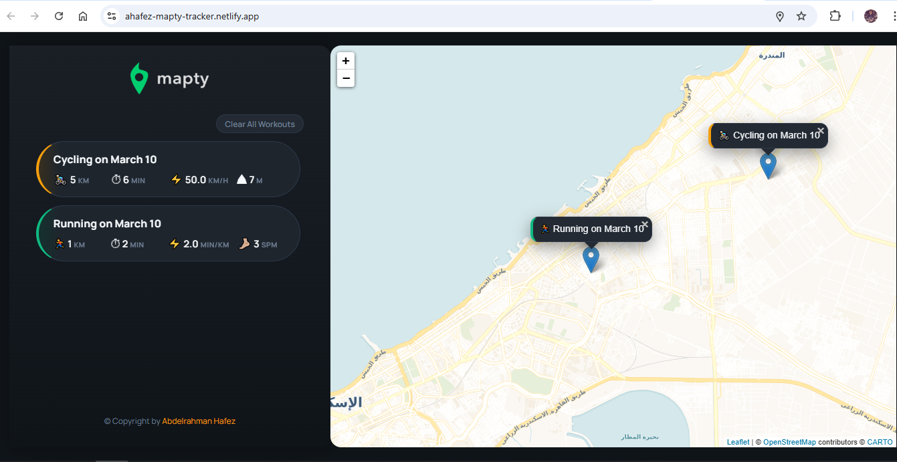

# Mapty – Pro Workout Tracker with Geolocation

[](https://developer.mozilla.org/en-US/docs/Web/JavaScript)
[](https://leafletjs.com/)
[](https://developer.mozilla.org/en-US/docs/Web/HTML)
[](https://developer.mozilla.org/en-US/docs/Web/CSS)

A **data-driven web application** for tracking outdoor running and cycling workouts on an interactive map. Click anywhere to log a workout with distance, duration, and type-specific metrics; data persists across sessions and is visualized with markers and a clean, modern interface.

---

## Description

**Mapty** turns the browser into a personal workout log tied to real-world locations. Users grant location access once; the app then centers the map on their position and lets them place workouts by clicking on the map. Each workout stores coordinates, distance, duration, and—depending on type—cadence (running) or elevation gain (cycling). The sidebar lists all activities with computed stats (pace/speed), and list items are clickable to fly the map to that workout. A dark-themed UI, pill-style cards, and smooth animations provide a polished experience without sacrificing clarity or performance.



**Live Demo:** https://ahafez-mapty-tracker.netlify.app/

---

## Key Technical Implementation

### Object-Oriented Programming (OOP)

The codebase is built around **classes and inheritance** with **true encapsulation** via private class fields:

- **`Workout`** — Base class holding core data: coordinates, distance, duration, date, and id. Internal state is stored in **private fields** (`#coords`, `#distance`, `#duration`, `#date`, `#id`, `#description`) and exposed only through getters/setters where needed. A protected `_setDescription()` method generates human-readable titles (e.g. *"Running on March 10"*).

- **`Running`** — Extends `Workout`; adds `cadence` (steps/min) and computes **pace** (min/km). Constructor calls `super()`, then `calcPace()` and `_setDescription()`.

- **`Cycling`** — Extends `Workout`; adds `elevationGain` and computes **speed** (km/h). Same pattern: `super()` then `calcSpeed()` and `_setDescription()`.

- **`App`** — Controller class that owns the map, workout array, and UI. It uses private fields (`#map`, `#mapZoomLevel`, `#mapEvent`, `#workouts`) so internal state is not accessible from outside, reducing coupling and bugs. Public surface is limited to the constructor and the behavior triggered by user events.

This structure keeps domain logic (workout types and calculations) separate from application logic (map, form, storage) and makes the data model easy to reason about and extend.

### Geolocation & Leaflet API

- On load, the app calls **`navigator.geolocation.getCurrentPosition()`** to request the user’s location. Permission is handled by the browser; if granted, the callback receives coordinates and initializes the map; if denied or unavailable, an error message is shown and the loading state is cleared.

- **Leaflet** is used to create the map (`L.map('map').setView(coords, zoom)`), attach a **tile layer** (CartoDB Voyager for a light, modern basemap), and handle **click events** on the map. Each click stores the event in `#mapEvent` and opens the workout form so the user can enter distance, duration, and type-specific fields.

- Markers are added with **`L.marker()`** and **`L.popup()`**; list items use **`setView()`** with `animate: true` to pan/zoom to the workout when clicked. The map instance and zoom level are kept in private fields and reused for all rendering and navigation.

### Persistent Storage

- Workouts are saved to **`localStorage`** as a JSON array after each add. On startup, **`_getLocalStorage()`** reads this array and passes each item to **`_workoutFromStorage()`**, which rehydrates plain objects into **`Running`** or **`Cycling`** instances based on `type` and the presence of `cadence` or `elevationGain`. This keeps the in-memory model correct (with methods and getters) and avoids duplicate serialization logic.

- The **Clear All Workouts** action removes the `workouts` key from `localStorage` and reloads the page, resetting the app to an empty state after user confirmation.

---

## Modern Features Added

| Feature | Description |
|--------|-------------|
| **Dark UI theme** | Sidebar and form use a dark palette (surfaces, borders, text) with accent colors for running/cycling and consistent focus states. |
| **Modern map tiles** | **CartoDB Voyager** provides a light, professional basemap that fits the layout without requiring an API key. |
| **Clear All Workouts** | Button in the sidebar clears all data from memory and `localStorage` (with confirmation) and reloads the app. Disabled when there are no workouts. |
| **Loading spinner** | While geolocation is resolving and the map is initializing, a spinner and “Loading map…” message are shown; they are hidden once the map is ready or on error. |
| **Input validation** | All numeric inputs are validated (finite, positive). Invalid fields get a red border and an inline error message with a short shake animation; no generic `alert()` for validation. |
| **Pill-style cards & animations** | Workout list items use a pill shape (large border-radius), subtle gradient by type, and a slide-in animation when a new workout is added. Hover state adds a slight shift and shadow. |
| **Responsive sidebar** | Sidebar uses flexbox, constrained width, and a scrollable workout list with a styled scrollbar so the layout stays usable with many entries. |

---

## Project Architecture

```
┌─────────────────────────────────────────────────────────────────┐
│                           App (controller)                        │
│  #map  #mapEvent  #workouts  #mapZoomLevel                       │
├─────────────────────────────────────────────────────────────────┤
│  constructor()                                                   │
│    → _getPosition() → _loadMap() | _hideMapLoading()             │
│    → _getLocalStorage() → _workoutFromStorage() → _renderWorkout()│
│    → _bindEvents()  (_newWorkout, _moveToPopup, _clearAll, etc.)  │
├─────────────────────────────────────────────────────────────────┤
│  User clicks map → _showForm() → form visible                    │
│  User submits form → _newWorkout() → validate → Running/Cycling  │
│    → push to #workouts → _renderWorkoutMarker() + _renderWorkout()│
│    → _hideForm() → _setLocalStorage() → _updateClearButtonState()│
│  User clicks list item → _moveToPopup() → #map.setView()         │
│  User clicks Clear All → _clearAllWorkouts() → localStorage + reload │
└─────────────────────────────────────────────────────────────────┘
```

The **App** class owns the lifecycle: it requests location, initializes the Leaflet map and tile layer, loads workouts from `localStorage` (rehydrating to class instances), and binds form submit, list clicks, and the Clear All button. All map and workout state lives in private fields; rendering and persistence are handled by internal methods. The **Workout** hierarchy is responsible only for data and derived values (pace, speed, description); it has no dependency on the DOM or the map.

---

## Technologies Used

| Technology | Role |
|------------|------|
| **JavaScript (ES6+)** | Classes, private fields, optional chaining, nullish coalescing, destructuring, template literals, arrow functions. |
| **Leaflet.js** | Map container, tile layer (CartoDB Voyager), markers, popups, click handling, `setView` with animation. |
| **HTML5** | Semantic structure, form inputs, `data-id` on list items, accessibility attributes (`role="alert"` on error message). |
| **CSS3** | Custom properties (dark theme), Flexbox and Grid for layout, transitions and keyframe animations, scrollbar styling. |

---

## Installation

1. **Clone or download** the project (ensure `index.html`, `style.css`, `script.js`, and `logo.png` are in the same directory).

2. **Serve the app over HTTP** (required for Geolocation and correct loading of Leaflet and tiles). Options:
   - **Live Server** (VS Code): Right-click `index.html` → “Open with Live Server”.
   - **Node:** `npx serve .` (or `npx serve final` if you’re in the parent folder).
   - **Python:** `python -m http.server 8000` then open `http://localhost:8000`.

3. Open the app in the browser, **allow location access** when prompted, and wait for the map to load. Click on the map to add a workout.

4. No build step or API keys are required; Leaflet and CartoDB tiles are loaded from CDNs.

---

## Project Structure

```
final/
├── index.html    # App shell, form, map container, loading overlay, Clear All button
├── style.css     # Dark theme, pill cards, animations, map and sidebar layout
├── script.js     # Workout / Running / Cycling classes, App controller, Leaflet + localStorage
├── logo.png      # Sidebar logo
└── README.md     # This file
```


